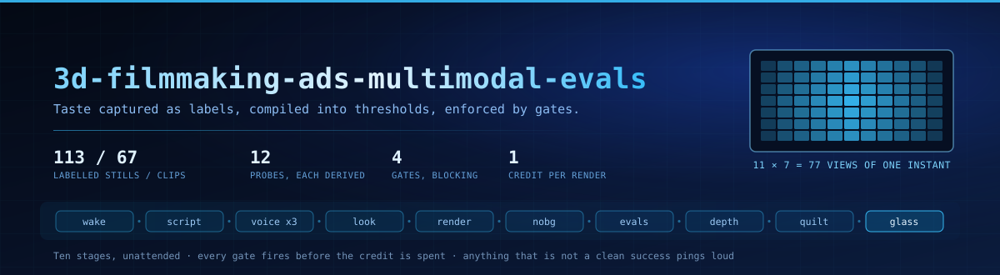
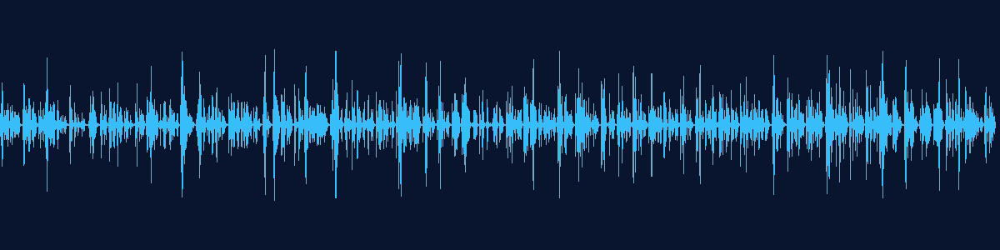

<p align="center">
  
</p>

# 3d-filmmaking-ads-multimodal-evals

An unattended AI filmmaking pipeline where the **evals are the product**.

It writes a script, speaks it in a cloned voice, renders a consistent generated
presenter, separates her from the background, infers depth, and emits 77 views of
each frame for a light-field display — on a schedule, against metered vendor APIs,
with nobody watching. What makes that safe to run unattended is not the render
path. It is that one person's taste was captured as labels, compiled into
thresholds, and wired into gates that can refuse to spend.

```
label  ->  derive  ->  gate  ->  render  ->  relabel
```

<table>
  <tr>
    <td width="34%" align="center">
      <br>
      <sub><b>Depth, on a flat screen.</b> A virtual camera sways across the inferred depth map.</sub>
    </td>
    <td width="33%" align="center">
      <br>
      <sub><b>77 views per frame.</b> <a href="assets/quilt-video.mp4">▶ full quilt video</a></sub>
    </td>
    <td width="33%" align="center">
      <br>
      <sub><b>She explains her own pipeline.</b> <a href="assets/glass-feed-demo.mp4">▶ watch with sound (2:49)</a></sub>
    </td>
  </tr>
</table>

> The presenter is generated — not a real person or a likeness of one. Her voice is
> a clone of a consented source. Every asset here comes from **one** run.

## What it does

Ten stages, from a scheduled wake to a light-field panel. Every image below is the
same frame carried through the chain:

<p align="center">
  
</p>

| # | stage | what happens |
|---|-------|--------------|
| 0 | Wake | a timer fires a headless run under a spend budget and timeout |
| 1 | Script | one agent picks *what* to say, another shapes *how* it sounds |
| 2 | Voice | instant clone; draw 3 takes, keep the median, diff transcript vs script |
| 3 | Look | generated character pinned to one identity; checked before any spend |
| 4 | Render | audio drives the animation from a fixed still (the still is the seed) |
| 5 | Matte | separate the presenter from the room, matte to pure black |
| 6 | Evals | probes score the clip; gates block or demand a written reason |
| 7 | Depth | monocular depth inferred locally on GPU, per frame |
| 8 | Quilt | warp one frame into a 7×11 array of 77 views |
| 9 | Glass | feed the quilt to a light-field panel |

## Listen

The 169-second cloned-voice narration — the kept median take, the exact audio the
clip carries:

<p align="center">
  
</p>

▶ **[assets/voice-narration.m4a](assets/voice-narration.m4a)** — 169s of the cloned voice.

## The core idea

A wrong number in a chart fails loudly. A generated person fails **plausibly** —
fuzzy hair, a mouth trailing the audio, a gesture landing late — invisible to a
type check, obvious to a person, and nobody is awake at render time. So taste is
captured as data and compiled into gates:

- **Label** — 113 stills and 67 clips hand-labelled; verdicts kept as data.
- **Derive** — every threshold comes from a labelled pass and fail exemplar, never typed.
- **Gate** — thresholds become guards that run before money is spent; judging is blind.
- **Relabel** — when eye and instrument disagree, the disagreement is the data.

## Repository layout

| path | what it is |
|------|------------|
| [`probes/`](probes/) | the measurement layer: each probe prints its own derivation |
| [`guards/`](guards/) | the enforcement layer: hooks that run before spend and ship |
| [`pipeline/`](pipeline/) | reference stage code (matte, depth, quilt) |
| [`tools/`](tools/) | the pre-publish PII scan |
| [`docs/`](docs/) | the doctrine (see below) |

## Try the measurement layer

The pipeline needs vendor accounts and a light-field panel. The measurement layer
does not:

```
pip install -r requirements.txt          # opencv-python, numpy; guards need jq

python3 probes/sync_probe.py             # no args: prints what it measures and why
python3 probes/sync_probe.py clip.mp4    # measures lip-sync lag on your clip
python3 probes/eye_eval.py --validate    # scores the harness against its labels
```

Reproduce the fail-open finding — take a guard's dependency away and read the exit code:

```
PROP_GATE=/nonexistent bash guards/pre_render_sanity.sh </dev/null; echo $?   # 0, and it says why
```

## Docs

- [`docs/EVALS.md`](docs/EVALS.md) — the eval doctrine: every threshold and every retracted metric
- [`docs/SETUP.md`](docs/SETUP.md) — clone your voice, generate your character, pin both
- [`docs/COST.md`](docs/COST.md) — the measured credit schedule and the 344-credit incident
- [`docs/RELIABILITY.md`](docs/RELIABILITY.md) — why the quality gate stopped blocking
- [`docs/ENFORCEMENT.md`](docs/ENFORCEMENT.md) — the four guards and which three fail open
- [`docs/EVIDENCE.md`](docs/EVIDENCE.md) — every number traced to what produced it
- [`docs/NOT-MEASURED.md`](docs/NOT-MEASURED.md) — what this repo does not claim, and why
- [`docs/PII-REVIEW.md`](docs/PII-REVIEW.md) — the pre-publish privacy gate

## Scope

One operator, one machine, one panel, one labeller. The labels are internally
consistent and externally unvalidated; a second labeller is the single most
valuable thing this repo is missing. Every figure is a count, never a rate —
a rate without a denominator is decoration.
