<p align="center">
  
</p>

<p align="center">
  
  
  
  
  
</p>

# 3d-filmmaking-ads-multimodal-evals

**An advertising-grade AI filmmaking pipeline where the evals are the product.**
It writes a script, speaks it in a cloned voice, renders a consistent generated
presenter, separates her from the background, infers depth, and emits 77 views of a
single instant for a light-field display — on a schedule, against metered vendor
APIs, with nobody watching. What makes that survivable is not the render path. It is
that one person's taste was captured as labels, compiled into thresholds, and wired
into gates that can refuse to spend.

<table>
  <tr>
    <td width="36%" align="center">
      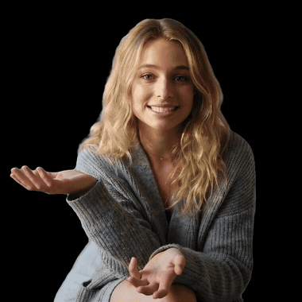<br>
      <sub><b>Depth, on a flat screen.</b> A virtual camera sways across the inferred depth map. Her torso shifts <b>22 px</b> between the extreme views and her face <b>20 px</b> — the 2 px differential is the parallax a flat pan can't produce.</sub>
    </td>
    <td width="30%" align="center">
      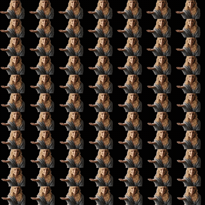<br>
      <sub><b>The file the panel eats.</b> Every frame carries its own 77 views, so parallax holds while she speaks. <b><a href="assets/quilt-video.mp4">▶ full quilt video</a></b></sub>
    </td>
    <td width="34%" align="center">
      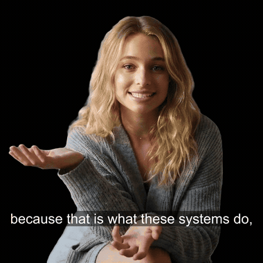<br>
      <sub><b>She explains her own pipeline.</b> One pass, start to finish. <b><a href="assets/glass-feed-demo.mp4">▶ watch with sound (2:49)</a></b></sub>
    </td>
  </tr>
</table>

> The presenter is generated — not a real person or a likeness of one. Her voice is
> a clone of a consented source. Every asset here comes from **one** run of the
> pipeline, deliberately: a montage of lucky takes would hide the thing this repo is about.

---

## What happens to her

Every image below is the **same frame** (`t = 63s`) of the same render. If two panels
disagree, it's the stage that changed her — not a different take or a luckier moment.

<p align="center">
  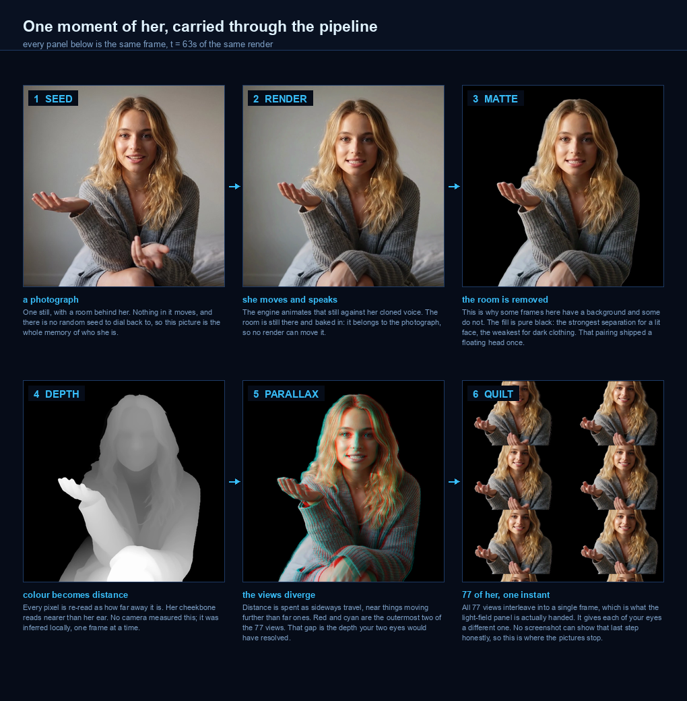
</p>

<table>
  <tr>
    <td width="34%" align="center">
      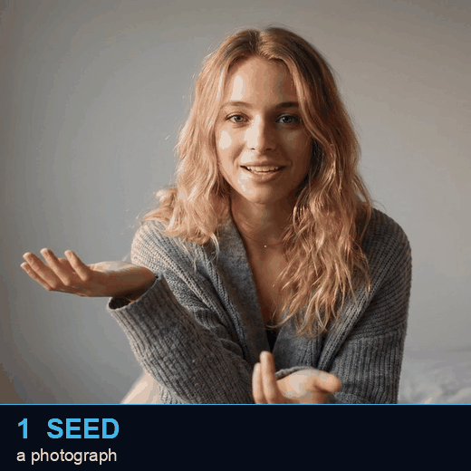<br>
      <sub><b>The six stages, cut.</b> A cut on a locked frame shows only what each stage changed.</sub>
    </td>
    <td>
      Stages 1–2 still carry the room, because the room is part of the photograph. Stage 3 removes it and fills pure black — the strongest separation for a lit face and the weakest for dark clothing, which is one decision, not two. This repo shipped a floating head before noticing that.<br><br>
      Stage 4 is where she stops being a picture and becomes a measurement: depth inferred locally, per frame, from a flat image no camera ranged. Stage 5 spends that depth sideways. Stage 6 packs all 77 disagreements into one frame. The chain ends there — no screenshot can reproduce what the panel hands each eye.
    </td>
  </tr>
</table>

---

## Evals lead this

A wrong number in a chart fails loudly. A generated human fails **plausibly** —
hair that fuzzes at the edge, a mouth trailing the audio, a gesture landing after its
word, eyes too still for thirty seconds. Each is invisible to a type check, obvious to
a person, different in tomorrow's draw. And nobody is awake at render time. So the
pipeline captures a human eye earlier, as data, and compiles it into gates:

```
label  ->  derive  ->  gate  ->  render  ->  relabel
```

- **Label** — 113 hand-labelled stills, 67 clips, 174 identity records, 677 A/B verdicts, a 14-render ledger. Plain-language verdicts, kept as data.
- **Derive** — every threshold in [`probes/`](probes/) comes from a labelled pass and fail exemplar, never typed. The eye model's background bar (4.5) sits between the worst pass (3.30) and the best reject (5.32); its self-test exits nonzero unless it matches the labels 100%.
- **Gate** — thresholds become guards that run before money is spent, judging blind. The same constraint held 14/15 runs at the outcome but only 6/15 at the first attempt — the gap is a pre-call hook, not better prose.
- **Relabel** — ten scoring models were built in one day and every one inverted against the labels. When eye and instrument disagree, the disagreement is the data.

Full doctrine, every number and every retraction: [`docs/EVALS.md`](docs/EVALS.md).

### The clip above, scored by its own probes

This clip does **not** pass everything — and the failures are the most useful thing on
the page, so they lead:

| probe | reading | bar | verdict |
|-------|---------|-----|---------|
| `sync_probe` | lag −240ms, early side | late fails at +80ms, early forgiven | IN BAND |
| `eye_eval` | bg 2.48 | max 4.5 | **PASS** |
| `scene_simplicity` | 4.22 | target 7.5 | SIMPLE |
| `bg_detail` | 2.71 | max 5.5 | SIMPLE |
| `separation_probe` | 10.42% within 30 luma of the fill | fail at 12% | **PASS, by 1.6 pts** |
| `hand_probe` | gesture ratio 0.506 | reported, never judged | highest measured |
| `level_probe` | face wander 35.1 | 8.0 | **FAIL** |
| `lipsync_probe` | dropped 25 of 58 onsets (43%) | no response within 0.8s | **FAIL** |
| `drift_probe` | flat corners, nothing to track | needs texture | INCONCLUSIVE |

- **The tightest pass matters most.** `separation_probe` clears its bar by 1.6 points, on a bar derived from just n=2 labelled points. It's reported with its margin, because a pass with 1.6 points of room is a different fact from a pass with 9.
- **One failure is real and explainable.** Face wander 35.1 vs a bar of 8.0 — this look is lit from one side, so face luminance genuinely swings. Whether 8.0 is the right bar for directional light is unknown; every exemplar behind it is flat-lit.
- **One failure survived every explanation.** Lip-sync reads 43%. Two confident causes (the still, then the engine) were both proven wrong. It ranges 19–43% across the grid with no clean association to any variable. Both of my explanations are ruled out; the honest state is that I can't yet separate "the metric's window is too tight" from "every clip drops phrases and the eye tolerates it."

Pre-spend, the same run: voice drawn 3× (7.7% spread, median kept), transcript diffed
before any render (541/541 words, similarity 1.0000), a 0.6s settle beat added, the
look attested against the frozen-prop rule, identity checked against the pin allowlist.
Two of those gates fired for real: the identity guard refused the fresh look until the
allowlist was refreshed, and the frozen-prop gate demanded a written finding before the
spend (the wall shifts 0 px across 26 samples, 0 reversals).

---

## Four separations

Not one generative model producing a video — four separations, each independently gated,
which is what makes any of it controllable.

<p align="center">
  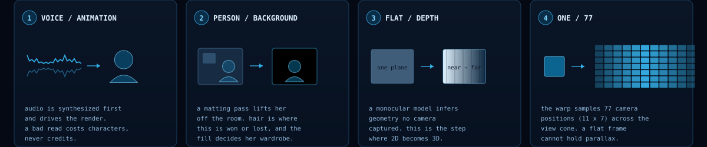
</p>

| | what comes apart | why it matters | governed by |
|---|---|---|---|
| **1** | **Voice from animation.** Audio is synthesized first and drives the render. | The performance is fixed and inspectable before a frame exists. | 3-draw median, transcript diff, settle beat |
| **2** | **Person from background.** A matting pass lifts her off the room. | Anything frozen behind her betrays the frame as dead. Hair is where it's won. | `bg_detail`, matte tuning |
| **3** | **Depth from the flat image.** A monocular model infers geometry no camera captured. | One rendered frame becomes a scene with distance. | depth inference on local GPU |
| **4** | **One view into 77.** The warp samples 77 camera positions across the view cone. | The panel needs every eye position at once. | quilt geometry, `drift_probe` |

Separation is why the evals can exist. A single end-to-end model leaves nothing to
measure between the prompt and the pixels.

---

## Architecture

<p align="center">
  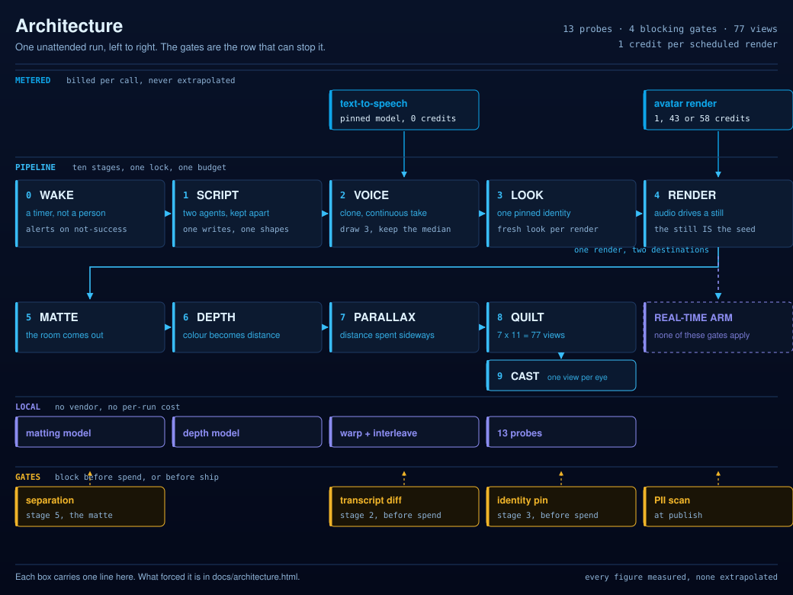
</p>

Four rows. **Metered** is anything a run can spend money on — exactly two vendors.
**Local** is everything that runs free on this machine, which is why a daily render
costs one credit and not a model bill. **Gates** sit under the stage they act on, and
only four of thirteen probes are there: the rest report a number and let the run
continue, because a metric that hasn't proven itself stable inside one clip hasn't
earned authority to stop one. Every figure in the diagram is published elsewhere in
this repo, and the generator refuses to write the file if those figures leave the README.

Interactive version: [`docs/architecture.html`](docs/architecture.html) — every box
clickable to the failure that forced it. Open it locally (`open docs/architecture.html`);
GitHub renders `.html` as source.

<p align="center">
  
</p>

## The suite, stage by stage

Ten stages. Every image is from the run at the top of this page, except the stage 0/1
panel, which carries the latest scheduled run's numbers.

<p align="center">
  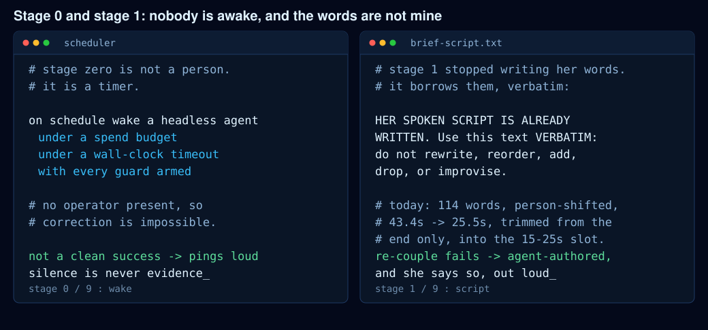
</p>

https://github.com/user-attachments/assets/9e30abab-52c0-41b8-be9a-e8170a4311f9

<p align="center"><sub><b>Press play: the soundtrack.</b> 169 seconds of the cloned voice, the kept median take, under its own waveform. Raw audio: <a href="assets/voice-narration.m4a">voice-narration.m4a</a>.</sub></p>

### 0. Wake

Supervised or unattended? A supervised pipeline can be corrected mid-flight and needs
no gates; an unattended one can't, so it needs every gate here.

> Unattended, on a timer — the interesting failures only appear when nobody is watching.
> Each run is a headless agent under a spend budget and a wall-clock timeout.

- A scheduled job fires the run, a lock stops races, a budget guard caps spend, a timeout kills a wedged leg.
- The alert test is inverted on purpose: it fires on everything that is **not** a clean success, so a novel failure is loud on day one rather than silent.

### 1. Script

Whose words, and whose register? Generic ad copy is safe and forgettable; real material
is specific and risky — two separable problems.

> Split across two agents. One assembles **what** to say from real working notes; a
> second, trained on years of my own prompts, shapes **how** it sounds. Keeping them
> apart also keeps the copywriter from being the thing that spends the render budget.

- The voice-shaping agent is a separate project. **Available on request.**
- This page's clip is a deliberate exception: for a public demo she explains the pipeline itself.
- Since the re-couple change (2026-07-30), the scheduled daily clip speaks borrowed words **verbatim** — the agent may trim from the end to fit the 15–25s slot, never rewrite. Today's run borrowed 114 words, trimmed 43.4s to 25.5s. A failed borrow ships as agent-authored and says so.
- Scripts held above 250 characters — shorter ones measured ~110 Hz brighter and less consistent.

### 2. Voice

Clone a real voice or license a synthetic one? Cloning is better and carries a consent
obligation that never expires. Clone only your own voice, or one with written permission.

> An instant clone from a single **continuous** source take. More audio lost this twice:
> a 69s stitched reference pitched the voice up (242/235 Hz vs 216) and scored lower on
> timbre (0.857–0.867 vs 0.925–0.939) than a 10s continuous original, then its clips were
> rejected by ear. Continuity beat quantity, twice.

- Fourteen candidate clones; the winner picked by ear, the runner-up 0.08% away — taste, and the numbers said so.
- Draw 3 takes, keep the **median by duration**. A single blind draw lands on a 6–37% spread, ~1 in 3 on a tail. This run drew 156.88 / 168.96 / 168.64s and kept the median.
- Transcribe and diff against the script: 541/541 words, similarity 1.0000. Skipped on nine earlier renders, reinstated after the fact.
- **The model is pinned, and getting it wrong is silent.** Nine clips shipped on the wrong TTS model — no error, just a flatter reading. It rested 11.4% vs the human's 19.0%; the only detector was a person saying it sounded flat.
- Add a 0.6s settle beat, since the synthesizer returns zero trailing silence.
- **Hear it:** [the kept take](assets/voice-narration.m4a), the exact audio the clip carries.

<table>
  <tr>
    <td width="33%" align="center"></td>
    <td width="33%" align="center">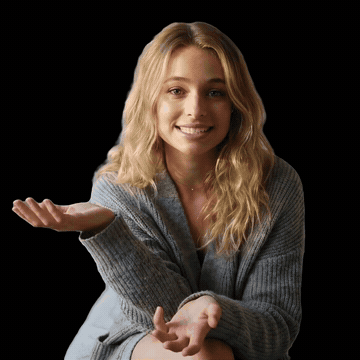</td>
    <td width="33%" align="center"></td>
  </tr>
</table>

### 3. Look

Own footage or a generated character? Own footage means a real face at the cost of a
shoot and a consent step; a generated character means no shoot and a disclosure
obligation that never lapses. This pipeline uses a generated character and discloses it
on every public surface.

> Every look is prompt-generated but anchored to one pinned identity group, so every
> approved look is provably the same person. A frontier image model can supply a
> reference still for art direction a prompt won't hold.

- Judge the look *before* spending: `bg_detail` must clear the labelled band, and a frozen-prop probe asks whether anything in frame becomes implausible if it never moves for thirty seconds.
- The identity guard checks the look against the pin allowlist — it fired during this rebuild, refusing a fresh look until the allowlist was refreshed.
- **Say nothing about hands.** Five hand-posing rules each produced a rejected clip: the engine drives mouth and head from audio while hands free-run, so mandated hand activity is motion uncorrelated with speech.
- Wardrobe must clear the matte. The first pass put a black top on a black-matted background — face cleared the fill by 134 luma, torso by 22, and the body dissolved into a floating head. Re-shot in cream: torso now 171. Eleven probes scored her and none asked whether you could see her.

### 4. Render

Text-to-video or audio-driven avatar? General video models are spectacular and
unpredictable; an audio-driven avatar is narrow, repeatable, and cheap. Advertising
needs the same presenter identical on Tuesday and Thursday.

> Audio drives the animation from a fixed still — the only reproducibility control on
> offer, since the vendor exposes no seed, so **the still is the seed**. The flat-rate
> engine is the scheduled default because it bills the same for 9 seconds as for 2 minutes.

- Upload audio, render against the pinned look, poll, download, burn subtitles from the transcriber's own word timings. This clip runs 169.2s.
- Cost is measured per engine, never extrapolated. Flat: 1 credit at 11s, 126s, 169s. Premium: 5 / 43 / **58**. A naive `ceil(sec/11)×5` predicts 60 for the render that cost 43, so the router returns null rather than guess.
- **This page's clip is the premium tier**, chosen by eye at 58× the default's cost — defensible for a portfolio clip watched once, wrong for a daily job, which stays on flat.
- Geometry is measured on the delivered file, not trusted from the request flag.

---

<p align="center">
  
</p>

## The fork

Everything up to here is shared. At this point the same presenter becomes two products,
separated by whether the output exists before anyone sees it.

> **Rendered** output is finished before it ships, so every gate here runs in the gap
> between "the file exists" and "a human sees it." **Live** output has no such gap: the
> voice is synthesized mid-conversation. The gating doctrine doesn't port — pre-spend
> review, which all nine invariants rest on, doesn't exist there at all.

- **Rendered path** (stages 5–9 below): matte, evaluate, infer depth, build the quilt, cast to glass. Fully built, runs on a timer, documented by the rest of this page.
- **Live path**: a real-time conversational avatar, **parked at its consent gate** deliberately — it requires a two-minute training video of a real person, and no agent may click it. Its streaming voice-agent side is a separate project. **Available on request.**

<table>
  <tr>
    <td width="33%" align="center">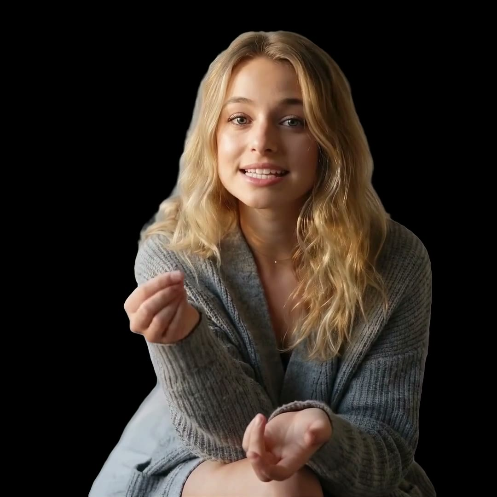</td>
    <td width="33%" align="center">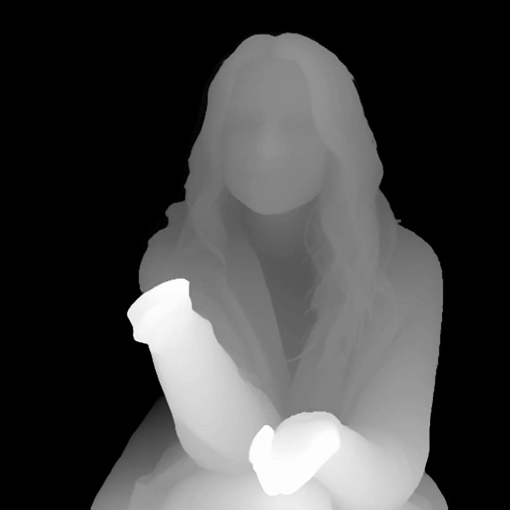</td>
    <td width="33%" align="center" valign="middle"><sub><b>8. Quilt</b> and <b>9. Glass</b> are the pair at the top: the 77-view array, and the panel that turns it back into depth.</sub></td>
  </tr>
</table>

### 5. Matte

Keep the room or separate the person? Keeping it reads as dead, because the engine
animates only her, so every frozen edge is a tell.

> Matte to pure black, tuned at the hair. Black is the one solid fill that reads as
> intentional; a colored fill reads as a cheap green screen.

- [`pipeline/matte_video.py`](pipeline/matte_video.py) carries its dated tuning history.
- Choosing black created the wardrobe trap in stage 3 — deciding the background also decides what she can wear, which nothing in the suite knew until it was measured.

### 6. Evals

Gate on the outcome or the attempt? Outcome metrics can't tell a system that complied
from one that was stopped. Measured at the outcome, one constraint held 14/15; at the
first attempt, 6/15. Only the second tells you the rule was being ignored and caught.

> Nine invariants, thirteen probes, every threshold derived from labelled exemplars,
> judging blind, a hard wall between metrics that **gate** and metrics that only
> **report**. Stability within a clip is required before authority over spend.

- The ship gate refuses on geometry failures and demands a written reason for judgement calls it can't make itself.
- Four guards were deliberately broken to test them; three approved everything when a single config file went missing, while still reporting green. Detail in [`docs/ENFORCEMENT.md`](docs/ENFORCEMENT.md).

### 7. Depth

Capture depth or infer it? Neither a depth camera nor a real subject exists here.
Inference works on any frame including a synthetic one.

> Monocular depth estimation running **locally** on the GPU (Apple Silicon MPS). It runs
> on every frame, so a per-frame API call would price the pipeline out of daily use.

- [`pipeline/depth_infer.py`](pipeline/depth_infer.py). On the frame above: load 1.9s, inference 0.4s.
- **Depth is normalized once across the whole clip** — a per-chunk range would make the depth pulse. Holding one range means holding every frame: a 128s clip at full res hit 13.4 GB resident and 16.6 GB swap.
- **The fix, written down before it was needed:** infer at half resolution and upscale. This page's clip (4230 frames, 32% longer) ran to **3.3 GB peak, zero swap** — a quarter of the cost. Chunking trades a visible artifact for an invisible ceiling.

### 8. Quilt

Ship a flat frame or a view array? A flat frame can never hold parallax; a view array
runs on light-field hardware only, and decouples the renderer from the display.

> 7 columns by 11 rows, 77 views, sampled across the display's view cone by a parallax
> warp driven by the depth map.

- [`pipeline/quilt.py`](pipeline/quilt.py) builds 77 views in 0.8s at 3360×3360.
- The geometry is a parameter now, and making it one *was* the fix: constants had been pinned at a legacy 8×6 (48 views) while production moved to 7×11. Nothing failed and nothing alerted, because a hardcoded constant can't disagree with the pipeline. That is the quietest failure class in the repo.

### 9. Glass

Screen or light field? A screen is everywhere and flat; a light-field panel is one
device on one desk that holds real depth — the reason the preceding nine stages are
shaped the way they are.

> The panel is fed the quilt and does the lenticular work itself. On failure it degrades
> to a known-good clip and **pings**, because a silent fallback is indistinguishable from success.

- A pre-ship gate checks the delivered geometry; a letterboxed clip is a hard failure here.
- The shipped product is a quilt **video**: every frame carries its own 77 views, 77 warps per output frame.

---

<p align="center">
  
</p>

## What measuring it turned up

| lesson | what happened |
|--------|---------------|
| **Count attempts, not outcomes.** | I asked the AI to follow a rule; it ignored me. I put the rule in code, where it can't be negotiated. It held every time — and the first thing it blocked was me. |
| **A metric that agrees isn't a metric yet.** | One check matched my eye 8/8, so I wired it in. Then it disagreed with itself by up to 10 frames inside one clip. Demoted within the hour. |
| **Your threshold might mean 'look like last time'.** | A brightness limit set from one 7.9 clip was failing every good clip. It meant "look like that one clip," and had steered me for hours. |
| **Delete its config. Still passes? Not a check.** | I broke four safety checks on purpose. Three approved everything when a file went missing, still green. Two didn't know they were doing it. |
| **Benchmarks prove speed, not cause.** | I made it 2.5× faster and wrote down why. The speedup was real; my explanation wasn't — the setting meant to run ten things ran one. |
| **When every predictor inverts, stop predicting.** | Ten scoring models in one day, all inverted on my eye. I switched to picking at random and went back to labelling by hand. |

Most of these are me finding my own work wasn't what I'd written down. That's the point.

---

<p align="center">
  
</p>

## The numbers

Measured, not estimated. Every figure carries its sample size — a rate without a
denominator is decoration.

| | | |
|---|---|---|
| Labelled stills / clips | 113 / 67 | hand-curated |
| Identity label records | 174 (115 `her`, 59 `not_her`) | plus an earlier 171-record pass |
| A/B verdicts logged | 677 | pairwise |
| Approved looks, one identity | 279 | pin allowlist |
| Scoring models built and killed | 10 in one day | every one inverted |
| Runs on schedule | 10 of 10 days, 0 missed | n=10 |
| Full chain completion | 4 of 7 | n=7 |
| Constraint held, outcome vs first attempt | 14/15 vs 6/15 | n=15 |
| Quality gate true positives | 0 of 7 | n=7 |
| Voice draw spread, this clip | 7.7% across 3 draws | median kept |
| Transcript check, this clip | 541/541 words, 1.0000 | before the spend |
| Depth peak memory, 3216 frames full res | 13.4 GB resident, 16.6 GB swap | the ceiling |
| Depth memory, 4230 frames half res | 3.3 GB peak, 0 swap, 458s | the applied fix |
| Quilt build | 77 views in 0.8s at 3360px | n=1 |
| Comparison run cost | 205 credits | balance measured before and after |

**What I can't tell you:** any dollar figure (no credit-to-currency rate was recorded)
or time saved (no manual baseline was ever measured). Both in
[`docs/NOT-MEASURED.md`](docs/NOT-MEASURED.md).

---

<p align="center">
  
</p>

## Cost

The scheduled pipeline renders on the **flat tier**: 1 credit at every length. The
premium tiers scale hard.

| engine tier | ~11s | ~126s | ~169s | shape |
|-------------|------|-------|-------|-------|
| flat (scheduled default) | 1 | 1 | 1 | flat with length |
| premium | 5 | 43 | **58** | scales, not knowably linear |

Every cell is a balance delta read before and after a real render — none interpolated.
The router refuses to interpolate because an earlier confident estimate understated a
premium batch by 8.6× and burned 344 credits. A null makes a caller ask; a confident 5
makes it spend 43. Full model and the incident: [`docs/COST.md`](docs/COST.md).

Voice is metered per character and synthesis costs zero render credits — which is why
the pipeline draws three voice takes and renders once.

---

<p align="center">
  
</p>

## Running it

The pipeline needs vendor accounts and a light-field panel. The **measurement layer**
does not, and it's the part worth reading:

```
pip install -r requirements.txt          # opencv-python, numpy; guards need jq

python3 probes/sync_probe.py             # no args: prints what it measures and why
python3 probes/sync_probe.py clip.mp4    # measures lip-sync lag on your clip
python3 probes/eye_eval.py --validate    # scores the harness against its labels
```

Every probe with no arguments prints its own derivation. To reproduce the fail-open
finding, take a guard's dependency away and read the exit code:

```
PROP_GATE=/nonexistent bash guards/pre_render_sanity.sh </dev/null; echo $?          # 0, and it says why
IDENTITY_PINS=/nonexistent bash guards/block_unpinned_identity.sh </dev/null; echo $?
```

The pre-publish privacy gate:

```
git config core.hooksPath .githooks
bash tools/pii_scan.sh
```

Want the same pipeline with your own voice and character?
[`docs/SETUP.md`](docs/SETUP.md) is the build order, consent line first.

---

## Read next

- [`docs/EVALS.md`](docs/EVALS.md) — the eval doctrine: every threshold and every retracted metric
- [`docs/SETUP.md`](docs/SETUP.md) — clone your voice, generate your character, pin both
- [`docs/COST.md`](docs/COST.md) — the measured credit schedule and the 344-credit incident
- [`docs/RELIABILITY.md`](docs/RELIABILITY.md) — why the quality gate stopped blocking
- [`docs/ENFORCEMENT.md`](docs/ENFORCEMENT.md) — the four guards and which three fail open
- [`docs/EVIDENCE.md`](docs/EVIDENCE.md) — every number traced to what produced it
- [`docs/NOT-MEASURED.md`](docs/NOT-MEASURED.md) — what this repo does not claim, and why
- [`docs/PII-REVIEW.md`](docs/PII-REVIEW.md) — the pre-publish privacy gate

Two companion projects are referenced above and are not public yet: the agent that
shapes her register, and the streaming voice-agent pipeline behind the live path. Both
**available on request**.

## Scope

One operator, one machine, one panel, one labeller. The labels are internally consistent
and externally unvalidated; a second labeller is the single most valuable thing this
repo is missing.
